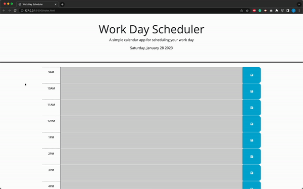

# Work Day Calender

## Description

This week task I was given a starter code for a work calender. I am task to add a current date, color coded time blocks base on th current time, and saving the user's input on local storage.

## Website

[Website link](https://jackbngn.github.io/Work-day-scheduler/)

## Requirement

- When the application is opened, the current date is displayed.
- The user is presented with a timeblock of standard business hour.
- The timeblock is color coordinated base on the current time
- User can click on the timeblock to add an event.
- When the user click the save button, the event is saved to the local storage.
- When the page is refreshed, the save item will stay on the page.

## Demo

